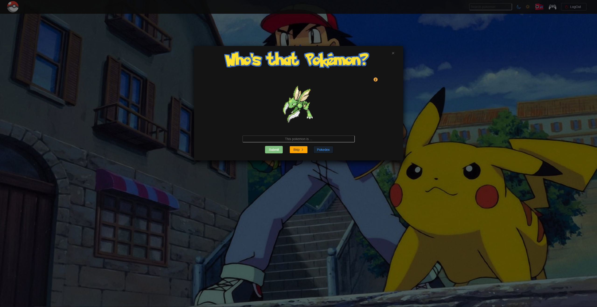

# Who's that Pokemon

Welcome to the **Who's that Pokemon** application! This application allows you to explore the world of Pokemon, where you can search, browse, and add your favorite Pokemons to your favorites. Here's how you can use the application:

## How to Use the Application

1. ✍️ **Registration and Login**: Register or log in to access all the features of the application.

2. 🔍 **Pokemon Search**: Use the search to find a specific Pokemon by entering its name or number.

3. ❤ **Adding to Favorites**: Add a Pokemon to your favorites by clicking the heart icon next to its name.

4. 📊 **Viewing Statistics**: View the statistics of the selected Pokemon to learn more about it.

5. 📒 **Filtering Pokemon**: Filter Pokemons by different criteria, such as favorites or caught Pokemons.

6. 🌙 **Night Mode**: Turn on or off night mode by clicking on the crescent moon symbol.

## How to Run the Application

1. **Running the Local JSON Server**: Open a terminal and in the application directory, run the following command:

   json-server --watch db.json

3. **Running the Application**: After starting the JSON server, run the application using the following command:

   npm run dev

## Technologies Used

- **Vue.js**: A powerful JavaScript framework for building user interfaces.
- **Vue Router**: A solution for managing routes in Vue applications.
- **Vue Cookies**: For managing cookies and authentication state.
- **Element Plus**: A component library for Vue.js.
- **JSON Server**: Simulates a REST API with a local JSON database.

## Author

The application was developed by [Trpimir Tomašić].

Thank you for using the Who's that Pokemon application! If you have any questions or feedback, feel free to contact us. Enjoy exploring the world of Pokemon! 🌟

